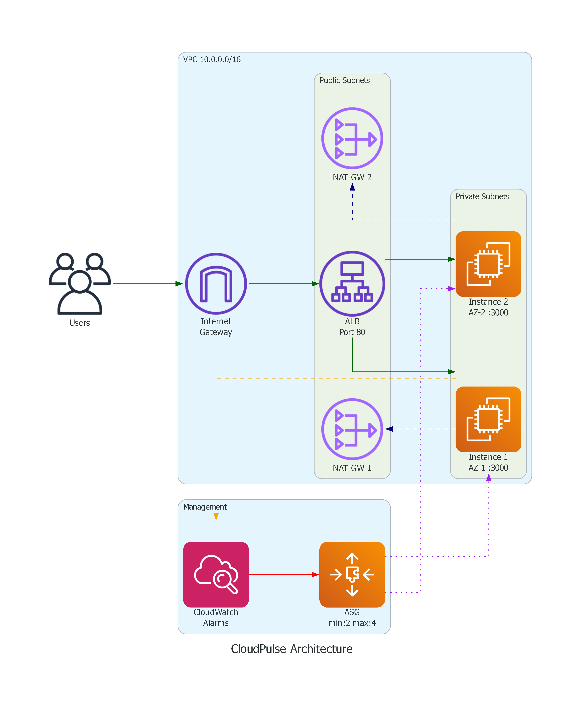
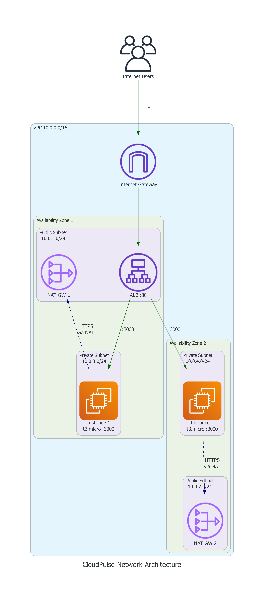
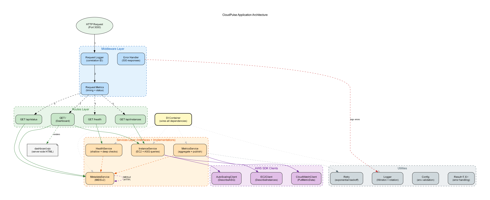

# CloudPulse

A self-healing infrastructure health dashboard built on AWS. The application monitors its own infrastructure, displays real-time health status, and automatically recovers from failures without human intervention.

This project exists as a hands-on learning tool for cloud engineers working through the AWS Core Compute and Networking curriculum. Every AWS service you need to understand for production-grade deployments is represented here, wired together in a way that actually makes sense.

## What This Project Does

CloudPulse is a TypeScript web application that runs on EC2 instances behind an Application Load Balancer. It watches itself. When you open the dashboard, you see which instances are healthy, how the Auto Scaling Group is configured, and what scaling events have happened recently. Kill an instance and watch the system heal itself in real time.

The infrastructure is provisioned entirely through AWS CLI shell scripts. No Terraform, no CloudFormation. Every API call is visible, commented, and explained. You will understand exactly what each command does and why it matters.

## Architecture

The system spans two Availability Zones for high availability.



Traffic flows from the internet through an Internet Gateway into the ALB sitting in public subnets. The ALB forwards requests to application instances in private subnets on port 3000. Instances reach the internet for AWS API calls through NAT Gateways. CloudWatch monitors CPU and triggers the Auto Scaling Group to add or remove instances as needed.

### Network Layout



Each Availability Zone has its own public subnet (hosting the ALB and a NAT Gateway) and its own private subnet (hosting application instances). Private instances have no public IP. All outbound traffic from private subnets routes through the NAT Gateway in the same AZ for fault isolation.

## AWS Services Covered

This single project touches every service in the Core Compute and Networking section:

- VPC with public and private subnets across 2 AZs
- Internet Gateway for public subnet internet access
- NAT Gateways (one per AZ) for private subnet outbound traffic
- Route tables with proper associations
- Network ACLs for subnet-level traffic filtering
- Security Groups following least-privilege principles
- Application Load Balancer with health checks
- EC2 instances via Launch Template
- Auto Scaling Group with self-healing and CPU-based scaling
- CloudWatch custom metrics and alarms
- IAM roles and instance profiles (no access keys on instances)
- EBS gp3 volumes with documented snapshot strategy
- SSM Session Manager for shell access without SSH keys

## Project Structure

```
.
├── app/                          # TypeScript application
│   ├── src/
│   │   ├── types/                # Result pattern, health, metrics, instance types
│   │   ├── services/             # Business logic (health, metrics, instance, metadata)
│   │   ├── middleware/           # Request logging, metrics collection, error handling
│   │   ├── routes/               # HTTP endpoints (health, API, dashboard)
│   │   ├── utils/                # Logger with rotation, retry with backoff
│   │   ├── views/                # EJS dashboard template
│   │   ├── config.ts             # Environment configuration with validation
│   │   ├── container.ts          # Dependency injection wiring
│   │   └── index.ts              # Application entry point
│   ├── tests/
│   │   ├── unit/                 # Service and middleware unit tests
│   │   ├── property/             # Property-based tests (fast-check)
│   │   └── integration/          # Full HTTP endpoint tests (supertest)
│   ├── package.json
│   ├── tsconfig.json
│   └── jest.config.ts
│
├── infra/                        # AWS CLI provisioning scripts
│   ├── scripts/
│   │   ├── iam.sh                # IAM role, policy, instance profile
│   │   ├── vpc.sh                # VPC, subnets, IGW, NAT, route tables, NACLs
│   │   ├── alb.sh                # Security groups, ALB, target group, listener
│   │   ├── compute.sh            # Launch template, ASG, scaling policies
│   │   └── monitoring.sh         # CloudWatch alarms
│   ├── user-data/
│   │   └── bootstrap.sh          # EC2 first-boot script (installs Node.js, starts app)
│   ├── tests/
│   │   ├── validate-vpc.sh       # Verifies VPC resources
│   │   ├── validate-security.sh  # Verifies security group rules
│   │   ├── validate-compute.sh   # Verifies ASG and launch template
│   │   └── validate-alb.sh       # Verifies ALB configuration
│   ├── lib/
│   │   ├── common.sh             # Shared utility functions
│   │   └── config.sh             # Shared configuration variables
│   ├── env/
│   │   └── resources.env         # Generated resource IDs (created by scripts)
│   ├── deploy.sh                 # One-command deployment
│   ├── teardown.sh               # One-command cleanup
│   └── validate.sh               # Post-deployment verification
│
└── README.md
```

## Prerequisites

You need these things set up before you start:

1. An AWS account. If you are on the free tier, be aware that NAT Gateways and the ALB are not free. Budget roughly five to six dollars per day if you leave everything running.

2. AWS CLI version 2 installed and configured. Run `aws configure` and provide your access key, secret key, and set the default region to us-east-1.

3. Node.js 20 or later installed on your local machine for building the application.

4. Git Bash or any bash-compatible shell for running the infrastructure scripts. On Windows, Git Bash works fine.

5. Verify your credentials work:
   ```
   aws sts get-caller-identity
   ```
   You should see your account ID and user ARN.

## Running Locally

You can run the application on your own machine to see how it behaves. It will show error indicators on the dashboard because the EC2 metadata service and AWS APIs are not available locally, but the health endpoint and application structure work correctly.

```bash
cd app
npm install
npm run build
```

Copy the EJS template into the build output (TypeScript compiler does not copy non-TS files):

```bash
mkdir -p dist/views
cp src/views/dashboard.ejs dist/views/
```

Start the application:

```bash
# Linux/Mac
ASG_NAME=cloudpulse-asg LOG_FILE_PATH=./app.log PORT=3001 node dist/index.js

# Windows PowerShell
$env:ASG_NAME="cloudpulse-asg"; $env:LOG_FILE_PATH="./app.log"; $env:PORT="3001"; node dist/index.js
```

Open http://localhost:3001 in your browser. The health endpoint at http://localhost:3001/health returns `{"status":"healthy"}`.

## Running Tests

The project has 101 tests across three categories:

```bash
cd app

# All tests
npm test

# Unit tests only
npm run test:unit

# Property-based tests (100 iterations each)
npm run test:property

# Integration tests (full HTTP request/response cycle)
npm run test:integration
```

## Deploying to AWS

### Step 1: Build and upload the application

Create an S3 bucket to host your compiled application code. The EC2 instances will pull from this bucket during boot.

```bash
aws s3 mb s3://cloudpulse-deploy-YOUR-ACCOUNT-ID --region us-east-1

cd app
npm run build
mkdir -p dist/views
cp src/views/dashboard.ejs dist/views/

aws s3 sync dist/ s3://cloudpulse-deploy-YOUR-ACCOUNT-ID/cloudpulse/latest/dist/
aws s3 cp package.json s3://cloudpulse-deploy-YOUR-ACCOUNT-ID/cloudpulse/latest/package.json
```

### Step 2: Configure the bootstrap script

Open `infra/user-data/bootstrap.sh` and uncomment the S3 sync line (around line 65). Replace the bucket name with yours:

```bash
aws s3 sync s3://cloudpulse-deploy-YOUR-ACCOUNT-ID/cloudpulse/latest/ "$APP_DIR/" --region us-east-1
```

Also add S3 read permission to the IAM policy. Open `infra/scripts/iam.sh` and add this statement to the policy document:

```json
{
  "Effect": "Allow",
  "Action": "s3:GetObject",
  "Resource": "arn:aws:s3:::cloudpulse-deploy-YOUR-ACCOUNT-ID/*"
}
```

### Step 3: Deploy

```bash
cd infra
bash deploy.sh
```

The script runs five provisioning scripts in order. The whole process takes about five minutes, mostly waiting for NAT Gateways to become available. At the end it prints the ALB URL.

### Step 4: Wait for health checks

After deployment, wait three to five minutes. The EC2 instances need time to boot, install Node.js, download your app from S3, and pass two consecutive ALB health checks.

Then open the URL printed by the deploy script. You will see the CloudPulse dashboard showing your live infrastructure.

## Testing Self-Healing

This is the interesting part. The whole point of the project is to watch the system recover from failure.

### Kill an instance

Find an instance ID from the dashboard (or from the AWS console), then terminate it:

```bash
aws ec2 terminate-instances --instance-ids i-0abc123def456
```

Watch the dashboard. Within one to two minutes:
- The terminated instance disappears from the healthy list
- The ASG detects the failure and launches a replacement
- The new instance boots, installs the app, and passes health checks
- Traffic continues flowing through the remaining healthy instance the entire time

### Trigger auto-scaling

Connect to an instance via SSM Session Manager:

```bash
aws ssm start-session --target i-0abc123def456
```

Inside the instance, generate CPU load:

```bash
stress --cpu 4 --timeout 180
```

After two minutes of sustained high CPU, the CloudWatch alarm fires and the ASG adds a third instance. When the load drops, the low-CPU alarm fires and the ASG removes the extra instance.

## Validating Infrastructure

After deployment, you can verify all resources match the expected configuration:

```bash
cd infra
bash validate.sh
```

This runs four validation scripts that check VPC settings, security group rules, ASG configuration, and ALB health check parameters.

## Tearing Down

When you are done learning, tear everything down to stop incurring charges:

```bash
cd infra
bash teardown.sh
```

The script deletes resources in reverse dependency order, waits for each deletion to complete, and releases all Elastic IPs. It logs every success and failure so you can verify nothing was left behind.

Run this every time you finish a learning session. NAT Gateways alone cost about two dollars per day if left running.

## Cost Awareness

Be honest with yourself about costs. Here is what this project costs when running:

| Resource | Hourly Cost | Monthly (24/7) | Free Tier |
|----------|-------------|----------------|-----------|
| EC2 t3.micro (x2) | $0.021 | $15 | 750 hrs for 1 instance |
| NAT Gateway (x2) | $0.090 | $65 | No |
| ALB | $0.023 | $16 | No |
| EBS gp3 8GB (x2) | negligible | $1.28 | 30GB free |
| CloudWatch alarms | $0 | $0 | First 10 free |

Total if running continuously: roughly $100 per month. But you should not run it continuously. Deploy, learn, experiment for a few hours, then tear down. A typical learning session costs less than a dollar.

## Application Design



The TypeScript application follows clean architecture principles. If you are a software engineer, you will appreciate the structure:

- Result pattern (discriminated unions) for error handling instead of thrown exceptions
- Dependency injection for all AWS SDK interactions, making the code fully testable without mocking libraries
- Interface-driven design where every service has a contract
- Middleware pattern for cross-cutting concerns (logging, metrics, error handling)
- Graceful degradation where the dashboard renders even when some AWS API calls fail
- Structured JSON logging with correlation IDs for request tracing
- File rotation to prevent disk exhaustion

## Environment Variables

| Variable | Required | Default | Description |
|----------|----------|---------|-------------|
| ASG_NAME | Yes | none | Auto Scaling Group name |
| PORT | No | 3000 | HTTP server port |
| AWS_REGION | No | us-east-1 | AWS region for SDK clients |
| METRICS_NAMESPACE | No | CloudPulse | CloudWatch namespace |
| METRICS_INTERVAL_MS | No | 60000 | Metrics publish interval |
| DASHBOARD_REFRESH_MS | No | 30000 | Dashboard auto-refresh interval |
| LOG_FILE_PATH | No | /var/log/cloudpulse/app.log | Log file location |
| LOG_MAX_SIZE | No | 50m | Max log file size before rotation |
| LOG_MAX_FILES | No | 5 | Max rotated log files to keep |
| HEALTH_CHECK_TIMEOUT_MS | No | 5000 | Health check timeout |
| RETRY_MAX_ATTEMPTS | No | 3 | Max retry attempts for AWS calls |
| RETRY_BASE_DELAY_MS | No | 1000 | Base delay for exponential backoff |

## API Endpoints

| Endpoint | Method | Description |
|----------|--------|-------------|
| / | GET | Dashboard HTML page with auto-refresh |
| /health | GET | ALB health check (returns 200 or 503) |
| /api/status | GET | Current instance ID, uptime, CPU usage |
| /api/instances | GET | All ASG instances with health status |

## What You Learn By Building This

After deploying and experimenting with this project, you will be able to:

- Design a VPC with proper network segmentation (public vs private subnets)
- Explain why NAT Gateways exist and when you need them
- Configure security groups that follow least-privilege
- Set up an ALB with health checks that actually detect application failures
- Create Auto Scaling Groups that heal themselves
- Use IAM roles instead of access keys on EC2 instances
- Publish custom CloudWatch metrics and create alarms that trigger actions
- Write infrastructure provisioning scripts that are idempotent and well-documented
- Tear down infrastructure cleanly without leaving orphaned resources
- Access instances securely via SSM without managing SSH keys
